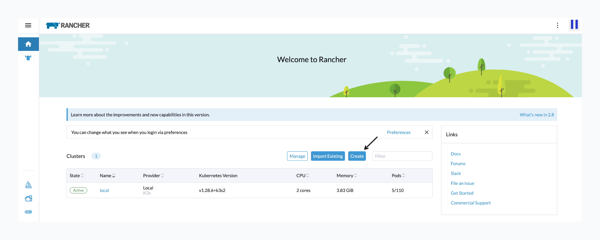
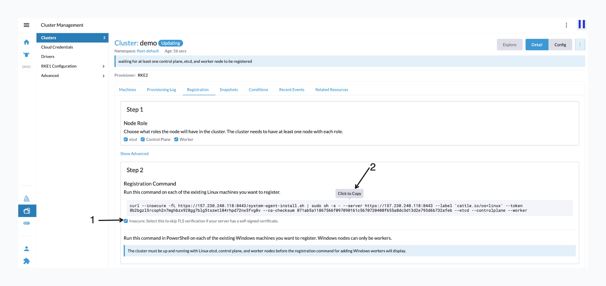
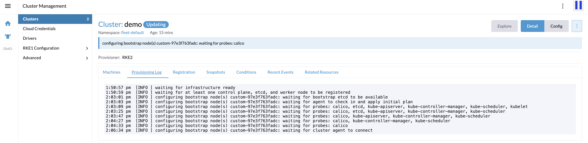
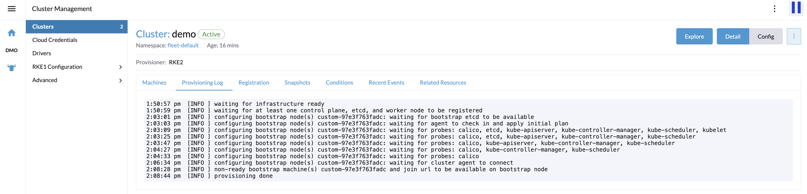
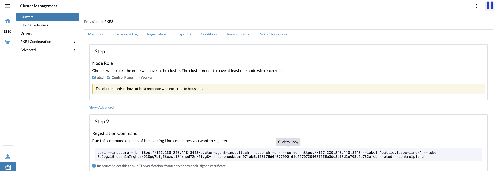
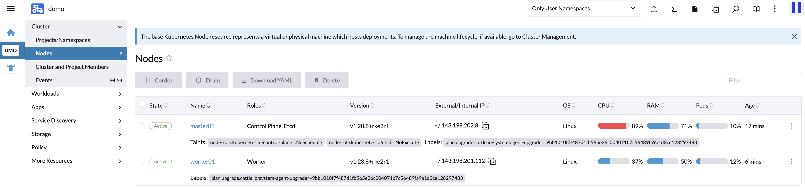
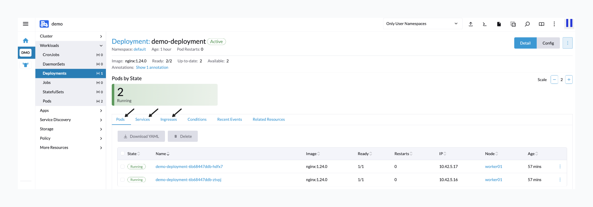
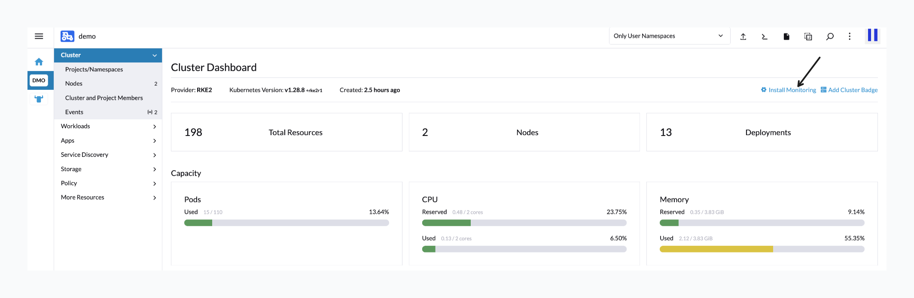
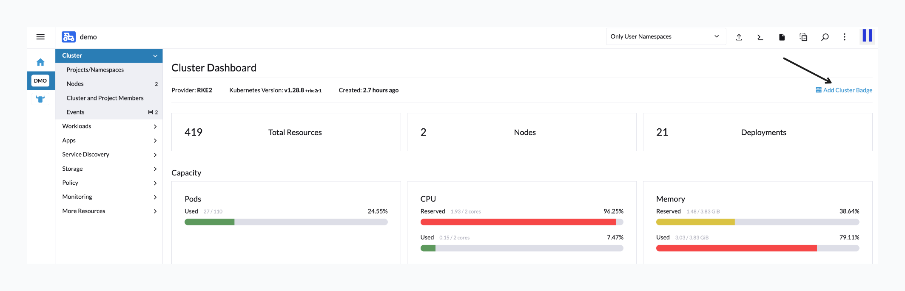

# Kubernetes & Rancher
> [!NOTE]  
> All nodes must be same network.

Steps
1. [Setup Rancher node](#1-setup-rancher-node)
2. [Setup Kubernetes cluster](#2-setup-kubernetes-cluster)

    2.1 [Create new cluster](#21-create-new-cluster)

3. [Deploy Application](#3-deploy-application)
4. [Monitoring](#4-monitoring)
5. [Rancher Configuration](#5-rancher-configuration)

## 1. Setup Rancher node

### Prerequisites
- [docker](https://docs.docker.com/engine/install/ubuntu/)
<!-- - kubectl: [install instuction](https://kubernetes.io/docs/tasks/tools/) -->

### Run Rancher

You can run by docker or docker compose

#### Option1: Run by Docker
```
docker run -d --restart=unless-stopped --name my-rancher -p 8080:80 -p 8443:443 --privileged rancher/rancher:v2.8.3
```

then go to http://localhost:8080

#### Option2: Run by Docker compose
Create docker-compose.yml
```
version: '3'
services:
  ranchers:
    image: rancher/rancher:v2.8.3
    container_name: my-rancher
    privileged: true
    volumes:
      - /opt/rancher:/var/lib/rancher
      - ${HOMEDIR}/certs/rancher:/var/lib/ca-certificates
    restart: unless-stopped
    ports:
      - 8443:443
      - 8080:80
```
then go to http://localhost:8080

Get password
```
docker logs my-rancher 2>&1 | grep "Bootstrap Password:"
```

## 2. Setup Kubernetes cluster 
### 2.1 Create new cluster

2.1.1 Click `Create` button



2.1.2 Next choose cluster provider, in this case we will use cluster from existing nodes so choose `custom`

2.1.3 Then input Cluster Name and click `Create` button

It will go to `Registraton` tab. For first node, Rancher must import bootstrap node(include etcd, controlpane and worker in a node).

2.1.4 Copy command line in Registration Command panel as image below



2.1.5 Go to __another node (boostrap node)__ and paste command that copy from previous step and waiting until done.

2.1.6 Back to Rancher web waiting until status is `Active`




You can checking node and another information in cluster dashboard

2.1.7 Back to Rancher web in `Registraton` tab add master node or worker node, copy the command



2.1.8 Go to __master/worker node__ and paste command that copy from previous step and waiting until done.

Now you can remove boostrap node.

Checking nodes



Done !!

---

## 3. Deploy Application

### 3.1 Create deployment
Go to sidebar menu: `Workloads > Deployments > Click Create button`

Input deployment configuration.

For example
- Namespace: `default`
- Name: `my-nginx`
- Replicas: `2`
- Container Tab / General Section
    - Container name: `demo-container`
    - Container name: `nginx:1.24.0`
- Pod Tab / Labels & Annotations Section
    - Pod Labels key: `app`
    - Pod Labels value: `my-nginx`

Click Create button 

### 3.2 Create service
Go to sidebar menu: `Service Discovery > Services > Click Create button`

Choosing Service type, For example `NodePort`

Input service configuration.

For example
- Namespace: `default`
- Name: `my-nodeport-service`
- Service Ports Section
    - Port Name: `my-nodeport-port`
    - Listening Port: `8080`
    - Target Port: `80`
    - Node Port: `30080`
- Selectors Section
    - key: `app`
    - value: `my-nginx`
- Labels & Annotations Section
    - Labels key: `app`
    - Labels value: `my-service`

Click Create button and go to `http://<node_ip>:30080`, should be display nginx page

### 3.3 Create ingress
Go to sidebar menu: `Service Discovery > Services > Click Create button`

Choosing Service type, For example `NodePort`

Input service configuration.

For example
- Namespace: `default`
- Name: `my-ingress`
- Rules Section
    - Request Host: `demo.example.com`
    - Path: `Prefix` | `/`
    - Target Service: `my-nodeport-service`
    - Port: `8080`

Click Create button and go to `http://demo.example.com`, should be display nginx page

> [!IMPORTANT]  
> You must edit `/etc/hosts` before
> 
> For example:
> ```
> 143.198.201.112   demo.example.com
> ```

Check detail. the deployment, service and ingress should be related



## 4. Monitoring

Click `Install Monitoring` on Cluster Dashboard page



Choosing tools for example: `monitoring` click install > next > install > waiting until finish (about 3-5 minutes)

Refreshing you can see `monitoring` menu on sidebar

You can see Prometheus and Grafana menu, able to access to monitoring tool dashboard

## 5. Rancher Configuration

#### Create User
Go to sidebar menu: `Users & Authentication > User > Click Create button`

Input Credentials & Permissions and Click Create button

### Decoration
#### Custom Clsuter Badge
Click `Add Cluster Badge` on Cluster Dashboard page



#### Banner
Go to sidebar menu: `Global setting (bottom icon) > Banners`

Custom header, footer and login banner

#### Branding

Go to sidebar menu: `Global setting (bottom icon) > Branding`

Custom Logo, primary color
